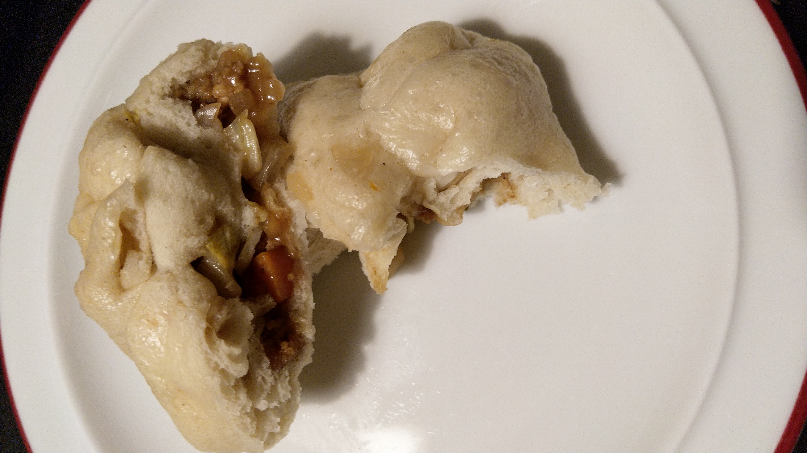

# Baozi

*asian, vegan, vegetarian, dough*

**3 Servings**

---

## Dough

- *6 g* dry yeast
- *240 ml* luke warm water (~36°C)
- *380 g* bread flour (Type 1050)
- *80 g* starch
- *70 g* sugar
- *2 Tbsp* salt
- *2 Tbsp* butter (vegan)

## Filling

- *200 g* tofu
- *1* carrot
- *250 g* chinese cabbage
- *2* green onions
- *1 Tbsp* soy flour
- *1 tsp* vegetable stock
- *0.5 tsp* MSG
- Worcester sauce
- (chinese cooking-) wine
- black soy sauce
- tamarind
- sesame oil
- ginger powder

## Equipment

- steaming basket for the cooking pot

---

1. Combine yeast and water, stir and let sit for 10 minutes.
2. Mix flour, starch, sugar and salt and slowly add the yeasty water while constantly mixing. Then knead the dough until smooth.
3. Add butter to the dough and knead about 8 to 10 minutes. Form a ball and add it to a lightly oiled bowl, cover with a towel and let sit at room temperature for about 1.5 hours.
4. Pre-heat a cast iron skillet, crumble tofu and add to the vigorously oiled pan, fry for 3 to 4 minutes.
5. Chop carrot into small cubes and add to the pan, stirring occasionally until they are nicely browned.
6. Chop cabbage and green onions. Add to the pan.
7. Deglaze the tofu and carrots with wine and add the other liquid ingredients. Add vegetable stock, MSG, soy flour and spices to taste. The goal is a thicker consistency.
8. Punch down the risen dough and roll it into a long roll. Cut into 12 to 15 pieces and lay down the pieces on the freshly cut sides. Then spread the outer regions with the fingers so a small bump stays in the center. Fill with about 2 tsp of filling and fold the rim, twisting in the end to shut.
9. Put about 4 baozi at a time in the steamer basket, leave enough space as these bad boys will rise. Put in a pot with boiling water, steaming 12 minutes.

Source:
- Dough by [Joshua Weissman](https://www.youtube.com/watch?v=8vtK56zVnD4)
- Filling inspired by [Babish](https://www.bingingwithbabish.com/recipes/baobuns)
